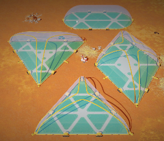

## Big Domes For All
 Allows building of big domes without breakthroughs.

### Description:
Domes unlocked:
  - Trigon
  - Oval
  - Diamond

### Options:
This mod has no options!

## Notes:
If you have any feedback please contact me directly instead of reporting the mod. I'm always happy to take requests as well. 
I hang out in [*Discord*](https://discord.gg/kTgYq9UjWx) and on [*Reddit*](https://www.reddit.com/user/Fizzle_Fuze)

Please take a second to rate this mod and leave a comment. 
Your feedback helps me produce better quality mods!

Have a good game, 
<3 Fiz

### Changelog:
 Details on the latest changes as well as changes in future versions are found in [*Info/changelog.md*](Info/changelog.md)

### Contact Me:
I appreciate feedback on my mods and ideas for new ones!
 - Discord:https://discord.gg/kTgYq9UjWx
 -  Reddit: /u/Fizzle_Fuze (/r/SurvivingMars)
 -  GitHub: https://github.com/Surviving-Mars-Mods
 -  Email: mods@fizzlefuze.com

See [*Info/ContactMe.txt*](Info/ContactMe.txt) for more info on contacting me. 

### Other Locations:
My mods are available on Steam, the Paradox Website, as well as GitHub:

[Steam Workshop](https://steamcommunity.com/id/fizzle_fuze/myworkshopfiles/?appid=464920)  
[Paradox Plaza](https://mods.paradoxplaza.com/games/surviving_mars?search=Fizzle_Fuze&sortBy=best)  
[GitHub](https://github.com/Surviving-Mars-Mods)

### Special Thanks
  - Thanks to everyone who has helped me learn to Mod better.
  - Thanks to ChoGGi for his excellent  examples and helpful attitude.
  - Thanks to everyone who enjoys my Mods and provides feedback on them.

### License:
 See [*Info/License.md*](Info/license.md) and [*Info/LICENSE*](Info/LICENSE) for copyright and licensing info.